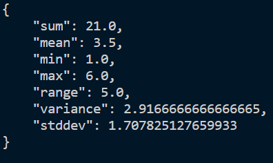
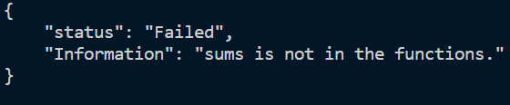

# Statistics Api  

### Operator Content
```
["sum", "mean", "min", "max", "range", "variance", "stddev"]
```
### How to use?  
```python
# input data is string or float, is OK
data = {"data": ["1","3", 2, 5, 4.0, 6.0], "operator":["sum", "mean", "min", "max", "range", "variance", "stddev"]}
res = requests.post(url = "http://ServreName:8080/Statistics/reduce", json = data)
print(res.text)
```
  

### Error  
```python
# sums is not method name
data = {"data": ["1","3", 2, 5, 4.0, 6.0], "operator":["sums", "mean", "min", "max", "range", "variance", "stddev"]}
res = requests.post(url = "http://ServreName:8080/Statistics/reduce", json = data)
print(res.text)
```
  

### Docker 
```shell
docker build -t ${name} .
```
```shell
docker run --rm -p 8080:8080 ${name}
```
